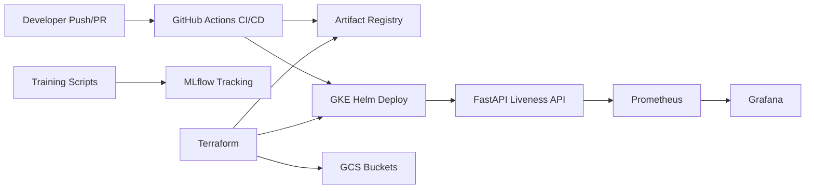

# Face Liveness Detection MLOps Stack

This repository productionizes a face liveness detection pipeline into an end-to-end MLOps stack on GKE:

- model inference API with FastAPI
- containerized runtime with multi-stage Docker
- Kubernetes deployment via Helm
- cloud infrastructure provisioning via Terraform
- training experiment tracking via MLflow
- observability via Prometheus and Grafana
- CI/CD via GitHub Actions with WIF-based GCP auth

## Model Summary

The core liveness model uses a global/local ONNX ensemble:

- Global Branch: MiniFASNetV2
- Local Branch: DeepPixBiS
- Face detection: SCRFD (`buffalo_l`)

Published offline evaluation:

- Accuracy: 89.28%
- Precision: 87.28%
- Recall: 93.11%
- F1-score: 90.10%

## MLOps Architecture



## Repository Layout

- `app/`: FastAPI serving app (`/livez`, `/readyz`, `/health`, `/predict`, `/metrics`)
- `src/pipeline/`: detection and liveness inference pipeline
- `src/train_global.py`, `src/train_local.py`: training scripts with MLflow hooks
- `helm/liveness-chart/`: Kubernetes chart for inference service
- `terraform/`: GCP infrastructure definitions
- `k8s/mlflow/`: MLflow manifests on Kubernetes
- `monitoring/`: ServiceMonitor and Grafana dashboard assets
- `.github/workflows/ci.yml`: CI/CD workflow
- `tests/`: API unit/integration tests

## Quickstart (Local API)

```bash
python -m venv .venv
source .venv/bin/activate
pip install -r requirements-dev.txt
uvicorn app.main:app --host 0.0.0.0 --port 8000
```

Verify:

```bash
curl http://127.0.0.1:8000/livez
curl http://127.0.0.1:8000/readyz
curl http://127.0.0.1:8000/health
curl http://127.0.0.1:8000/metrics
```

## Testing

CI-safe tests:

```bash
pytest tests/ -m "not integration" --cov=app --cov-fail-under=80
```

Integration tests (local/manual):

```bash
pytest tests/test_api_integration.py -m integration -v
```

## Deploy on Kubernetes (Helm)

```bash
helm lint helm/liveness-chart
helm upgrade --install liveness ./helm/liveness-chart
kubectl get pods
kubectl get svc
```

## Infrastructure (Terraform)

```bash
terraform -chdir=terraform init
terraform -chdir=terraform fmt -check
terraform -chdir=terraform plan
```

Files:

- `terraform/main.tf`
- `terraform/variables.tf`
- `terraform/outputs.tf`
- `terraform/backend.tf`

## Observability

Monitoring assets are in `monitoring/`:

- `monitoring/kube-prometheus-stack-values.yaml`
- `monitoring/servicemonitor.yaml`
- `monitoring/grafana-dashboard-configmap.yaml`
- `monitoring/grafana-dashboard.json`
- `monitoring/README.md`

## CI/CD (N9)

Workflow: `.github/workflows/ci.yml`

- pull request to `main`: `test` + `lint`
- push to `main`: `test` + `lint` + `build_push` + `deploy`

Detailed setup guide (GitHub Variables/Secrets and WIF):

- `documents/N9_CICD.md`

## Evidence Checklist for CV

Capture and add screenshots of:

1. GitHub Actions run where all jobs pass (`test`, `lint`, `build_push`, `deploy`)
2. Grafana dashboard with request/error/latency data
3. MLflow experiment run with metrics/artifacts
4. Kubernetes rollout success (`kubectl rollout status`)

## CV-ready bullets

Ready-to-copy bullet points:

- `documents/CV_BULLETS.md`

## License

MIT